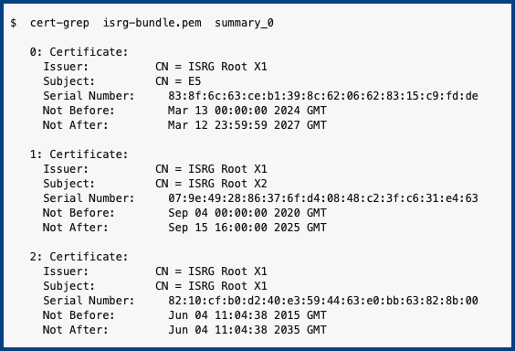
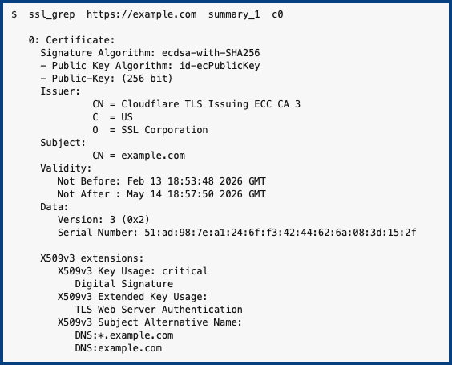
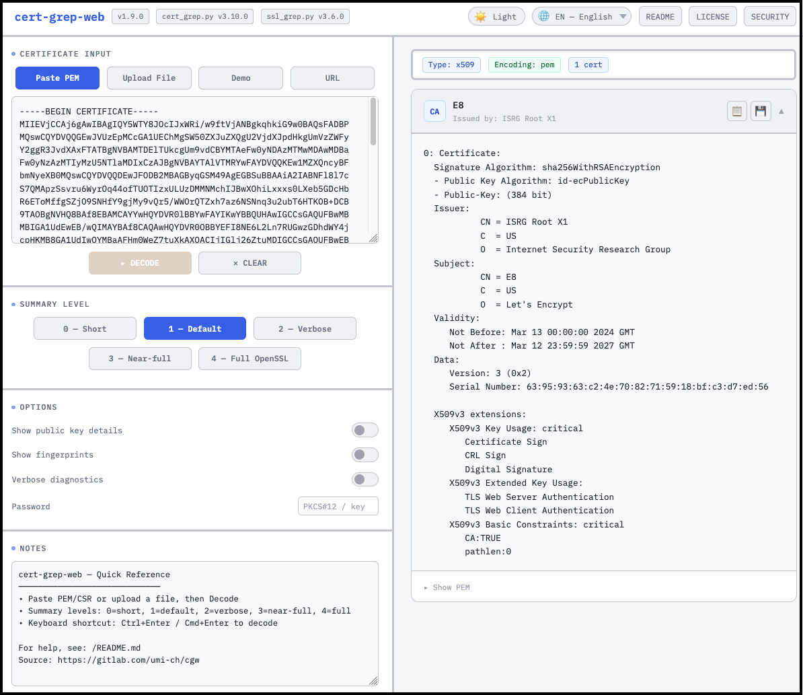

# CertGrep Suite : X.509 Certificate Inspectors

Source: [gitlab.com/umi-ch/cert-grep](https://gitlab.com/umi-ch/cert-grep)

> This documentation is available in Dutch, German, French, Italian, Spanish, and Swedish.
> Translations are served from the CertGrep Web interface — see [INSTALL.md](docs/en/INSTALL.md)
> for deployment instructions.

**CertGrep CLI** (`cert-grep.py`) decodes X.509 and PKCS#7 certificates, PKCS#10 CSRs,
PKCS#12 containers (.p12/.pfx), Java KeyStores (.jks/.jceks), X.509 CRLs,
and private/public keys (RSA/EC/Ed25519/Ed448/DSA) in PEM/DER format,
with auto-detection and nicely formatted summary output.

**SSL Grep** (`ssl-grep.py`) fetches live TLS certificate chains from any host
and displays them using CertGrep CLI.

**CertGrep Web** is a self-hosted Flask/Kubernetes web UI that provides
browser-based certificate inspection with no external dependencies,
no tracking, and no data retention.


### CertGrep CLI



### SSL Grep



### CertGrep Web

Paste PEM, upload files (including PKCS#12 and DER), probe live TLS
endpoints with SSL Grep, or browse the built-in sample corpus —
all from the browser.



Part of the [CertGrep](https://gitlab.com/umi-ch/cert-grep) suite.

Copyright © 2026, Mountain Informatik GmbH.<br/>
Original software by John Buehrer.<br/>
Licensed under [AGPL-3.0 with dual-license option](docs/en/LICENSE.md).


## Requirements

```
pip install cryptography
```

or equivalently:

```
pip install -r bin/requirements.txt
```

Python 3.10+. No other dependencies.

For Java KeyStore (.jks/.jceks) support, optionally install:

```
pip install pyjks
```

or equivalently:

```
pip install -r bin/requirements-jks.txt
```

Note: `pyjks` has native dependencies that may require a C compiler
and development headers (e.g. `build-essential`, `libffi-dev` on
Debian/Ubuntu).  Installation can fail in restricted or minimal
environments.  CertGrep works without it — JKS files will simply
show a helpful install hint.

We recommend using the latest Python and `cryptography` library releases
to get the best support for emerging post-quantum certificates and keys
(ML-DSA, ML-KEM, SLH-DSA) as they appear in the ecosystem.


## Installation

Add the directory to your `$PATH`, or copy the scripts directly:

```bash
git clone https://gitlab.com/umi-ch/cert-grep.git
export PATH="$PWD/cert-grep/bin:$PATH"
```

Both scripts are self-contained single files — no package install needed.

For CertGrep Web deployment (Docker, Kubernetes), see [INSTALL.md](docs/en/INSTALL.md).


## Quick Start

```bash
# Inspect a certificate
$ cert-grep.py  cert.pem

# Inspect a CSR
$ cert-grep.py  device.csr

# Inspect a CRL
$ cert-grep.py  ca.crl

# Inspect a private key (safe summary — no key material shown)
$ cert-grep.py  server-key.pem

# Inspect a public key
$ cert-grep.py  server-pub.pem

# Inspect a PKCS#12 bundle (cert + key + chain)
$ cert-grep.py  bundle.p12

# Fetch a live TLS chain
$ ssl-grep.py  https://example.com
```


## CertGrep CLI

<pre><code><small>$ cert-grep.py --help

cert-grep.py v3.19.0

Usage:
  $ cert-grep.py  &lt;cert_file&gt;  [options...]
  $ cat &lt;cert_file&gt; | cert-grep.py -  [options...]

Library usage:
  from cert_grep import cert_grep
  text = cert_grep("cert.pem", level=2, show_pub=True)
  text = cert_grep("bundle.p12", password="secret")
  text = cert_grep(&lt;cert_file&gt; or "-", level=0)
  text = cert_grep("--version", output=None)

Options (case-insensitive, order-independent):
  0 | summary_0      Short: Issuer CN, Subject CN, Serial, Validity
  1 | summary_1      Default: Algorithms, DN breakdown, Validity, Key extensions
  2 | summary_2      Verbose: All extensions + fingerprints
  3 | summary_3      Near-full: Full text, hex lines stripped
  4 | full           Full OpenSSL-style text output

  pem                 Assume PEM format, skip auto-detect
  der                 Assume DER format
  x509                Assume X.509 type format
  p7 | pkcs7          Assume PKCS#7 type format
  csr                 Assume CSR (PKCS#10) type format
  crl                 Assume CRL type format
  key                 Assume private key type format
  pubkey              Assume public key type format
  p12 | pkcs12 | pfx  Assume PKCS#12 container format
  jks | jceks         Assume Java KeyStore format
  b64                 Assume base64 format

  pub               Show public key details (RSA/ECC/EdDSA)
  fp                Show fingerprints (MD5, SHA-1, SHA-256)
  ver               Verify certificate chain (2+ certs)
  weak              Scan for cryptographic weaknesses (policy-driven)
  file              Save decoded certificate in current directory
  c0                Show only the first certificate (cert 0)
  cN                Show only item N (e.g. c0, c1, c42)

  -v, --verbose     Verbose diagnostics (stacks: -v -v for more)
  -V, --version     Show version and exit
  -h, --help        Show this help

  PW=&lt;password&gt;     Supply passphrase for encrypted keys / PKCS#12
  PW=prompt         Prompt interactively for the passphrase
  PW=env:&lt;VAR&gt;      Read passphrase from environment variable
  PW=file:&lt;path&gt;    Read passphrase from first line of file

  WEAK=&lt;path&gt;       Load additional weakness policy file(s)
                    (comma-separated, globs supported)
                    Default: configs/weak.conf (relative to cert-grep.py)

$VERBOSE=2 gives more diagnostics. Equivalent to -v / -v -v on the command line.

Examples:
  $ cert-grep.py cert-example.pem
  $ cert-grep.py cert-example.pem summary_0
  $ cert-grep.py cert-example.pem summary_2 pub fp
  $ cert-grep.py cert-example.der DER
  $ cert-grep.py cert-example.p7b
  $ cert-grep.py cert-example.b64

  $ cert-grep.py fullchain.pem ver              # - verify certificate chain
  $ cert-grep.py fullchain.pem weak             # - scan for weaknesses
  $ cert-grep.py fullchain.pem ver weak         # - both: verify + weakness scan
  $ cert-grep.py cert.pem WEAK=quantum.conf     # - custom weakness policy
  $ cat cert.pem | cert-grep.py - summary_0
  $ cert-grep.py device.csr                   # - CSR auto-detected
  $ cert-grep.py device.csr.der DER           # - CSR in DER format
  $ cat device.csr | cert-grep.py - csr       # - CSR from stdin
  $ cert-grep.py ca.crl                       # - CRL auto-detected
  $ cert-grep.py ca.crl summary_2             # - CRL with revoked entries
  $ cert-grep.py server-key.pem               # - private key auto-detected
  $ cert-grep.py server-key.pem pub           # - with public key details
  $ cert-grep.py mykey.pem key                # - force key type detection
  $ cert-grep.py bundle.p12                   # - PKCS#12 auto-detected
  $ cert-grep.py bundle.pfx summary_2 fp      # - PKCS#12 verbose + fingerprints
  $ cert-grep.py bundle.p12 PW=mysecret       # - PKCS#12 with password
  $ cert-grep.py bundle.p12 PW=prompt         # - interactive password prompt
  $ cert-grep.py bundle.p12 PW=env:P12_PASS   # - password from env var
  $ cert-grep.py bundle.p12 PW=file:/tmp/pw   # - password from file
  $ cert-grep.py encrypted-key.pem PW=secret  # - decrypt private key

Private key summary:
  Private keys are auto-detected by PEM markers or filename (*-key*, *.key).
  Only safe metadata is shown: type, size, curve, PEM format, encryption status,
  and public key fingerprint (for matching to certificates).
  No private key material is ever displayed.
  Encrypted keys are detected but cannot be inspected without the passphrase.
  Use PW=&lt;password&gt; to decrypt and inspect encrypted keys.

PKCS#12 containers (.p12, .pfx):
  PKCS#12 files are auto-detected by filename (.p12, .pfx) or binary content.
  All components are shown: certificate(s), CA chain, and private key summary.
  The private key summary follows the same safe-metadata rules as standalone keys.
  Password-protected PKCS#12 files require PW=&lt;password&gt; to inspect.
  Without a password, a graceful "password required" message is shown.
  Use 'file' to save the certificate(s) as PEM (key is not saved).

Java KeyStores (.jks, .jceks):
  JKS/JCEKS files are auto-detected by filename (.jks, .jceks) or magic bytes.
  Entry types: trustedCertEntry, privateKeyEntry, secretKeyEntry (JCEKS).
  All entry aliases are shown. Certificates and private keys use the same
  formatters as standalone files; secret keys show algorithm and size.
  Default password 'changeit' is tried automatically (Java convention).
  Requires the 'pyjks' library: pip install pyjks

FYI:
  Post-Quantum Cryptography (ML-DSA, ML-KEM, SLH-DSA) certificates are detected
    and displayed, but full PQC key decoding requires pyca/cryptography PQC support.
    Tracking: https://github.com/pyca/cryptography/issues/12610
  Hybrid certificate extensions (2.5.29.72/73/74) are recognized and decoded.

See also:
  Source:     https://gitlab.com/umi-ch/cert-grep
  Web UI:     https://gitlab.com/umi-ch/cert-grep (web/ directory)
  Test data:  https://gitlab.com/umi-ch/bashrc/-/tree/main/zPKI
  Library:    https://pypi.org/project/cryptography
              https://cryptography.io/en/latest
</small></code></pre>


### Chain Verification

With the `ver` option, CertGrep checks the internal consistency of
certificate chains (PEM bundles and PKCS#12 containers with 2+ certificates):

- **Chain linkage** — Subject ↔ Issuer DN matching (auto-reorders reversed chains)
- **Signature verification** — each certificate is cryptographically signed by its issuer
- **Validity period** — not-before / not-after date checks
- **CA constraints** — basicConstraints CA:TRUE on issuing certificates
- **Key usage** — keyCertSign present on issuing certificates
- **Path length** — pathLength constraint enforcement

These are offline checks against the certificates you have — no network
access, no trust store lookup, no revocation (CRL/OCSP) checking.

The `tests/test_corpus/chains/` directory contains 12 purpose-built
chain test files covering each error condition (bad signatures, expired
certs, missing CA flags, pathLength violations, etc.).  The generator
script `tests/regen_chains.py` can regenerate them.  All test certificates
include SKI/AKI extensions so chain relationships are visible in the
decoded output.

For live TLS chain testing, see also: https://badssl.com


### Weakness Scan

With the `weak` option, CertGrep scans certificates for cryptographic
weaknesses and policy violations.  Unlike chain verification (which
checks protocol-defined correctness), weakness rules are *policy decisions*
driven by a config file — so they can be customized per deployment.

```bash
# Scan with default rules (RSA 1024, SHA-1, MD5, etc.)
$ cert-grep.py  cert.pem  weak

# Scan with custom policy (e.g. quantum migration)
$ cert-grep.py  cert.pem  weak  WEAK=configs/quantum.conf

# Both: verify chain integrity + scan for weaknesses
$ cert-grep.py  fullchain.pem  ver  weak
```

The default policy (`configs/weak.conf`) flags universally agreed
weaknesses: RSA/DSA ≤1024-bit, EC ≤160-bit, MD2/MD5/SHA-1 signatures.
For custom audits, add rules or load additional config files with `WEAK=`.

A quantum migration example (`configs/quantum.conf`) flags RSA ≤3072,
EC ≤384, and DSA ≤3072 as advisories — useful for organizations planning
post-quantum transitions.

The `tests/test_corpus/weak/` directory contains 12 purpose-built
test files covering each weakness category.  The generator script
`tests/regen_weak.py` can regenerate them.


## SSL Grep

<pre><code><small>$ ssl-grep.py --help

ssl-grep.py v3.8.0  (cert-grep.py v3.19.0)

Usage:
  $ ssl-grep.py  &lt;host_or_url&gt;  [options...]

Options (case-insensitive, order-independent):
  0 | summary_0      Short: Issuer CN, Subject CN, Serial, Validity
  1 | summary_1      Default: Algorithms, DN breakdown, Validity, Key extensions
  2 | summary_2      Verbose: All extensions + fingerprints
  3 | summary_3      Near-full: Full text, hex lines stripped
  4 | full           Full OpenSSL-style text output

  pub               Show public key details (RSA/ECC/EdDSA)
  fp                Show fingerprints (MD5, SHA-1, SHA-256)
  ver               Verify certificate chain
  weak              Scan for cryptographic weaknesses (policy-driven)
  file              Save decoded certificate(s) to current directory
  c0                Show only the first certificate (cert 0)
  cN                Show only item N (e.g. c0, c1, c42)

  -v, --verbose     Verbose diagnostics (stacks: -v -v for more)
  -V, --version     Show version and exit
  -h, --help        Show this help

  WEAK=&lt;path&gt;       Load additional weakness policy file(s)
                    Default: configs/weak.conf (relative to cert-grep.py)

Target formats (all equivalent for port 443):
  $ ssl-grep.py  https://example.com
  $ ssl-grep.py  https://example.com/path/to/page
  $ ssl-grep.py  example.com
  $ ssl-grep.py  example.com:443
  $ ssl-grep.py  example.com:8443        # non-standard port

Examples:
  $ ssl-grep.py  https://example.com
  $ ssl-grep.py  https://example.com  summary_0
  $ ssl-grep.py  https://example.com  summary_0  pub
  $ ssl-grep.py  https://example.com  2  fp
  $ ssl-grep.py  example.com:443  full
  $ ssl-grep.py  example.com  ver        # fetch + verify chain
  $ ssl-grep.py  example.com  weak       # scan for weaknesses
  $ ssl-grep.py  example.com  ver weak   # both: verify + weakness scan
  $ ssl-grep.py  example.com  file       # save PEM files

Environment variables: 
  $VERBOSE                  Verbosity level (0-2), like -v
  $BASHRC_SSL_TIMEOUT       Override connect timeout (seconds, default: 5)
  $BASHRC_SSL_NO_TIMEOUT    Suppress timeout protection
  $https_proxy / $http_proxy   HTTP CONNECT proxy (e.g. http://proxy:8080/)

See also:
  $ cert-grep.py --help
  Source:  https://gitlab.com/umi-ch/cert-grep
  Web UI: https://gitlab.com/umi-ch/cert-grep (web/ directory)
</small></code></pre>


## CertGrep Web

CertGrep Web is a self-hosted Flask/Kubernetes web UI that provides
browser-based certificate inspection.  It imports `cert-grep.py`
directly — there is **no duplicated code**.

### Web Features

- **Paste PEM** or **upload** files — certificates, CSRs, CRLs, private keys, PKCS#12 (.p12/.pfx)
- **Multi-file upload** with cross-file chain verification and weakness scanning
- **Password file support** — glob-mapped passwords for batch PKCS#12 / JKS decoding
- **Mixed PEM bundles** — cert+key files display both components
- **Password support** — decrypt PKCS#12 containers and encrypted private keys
- **URL mode** — fetch and inspect TLS certificate chains from any HTTPS host
- **Real-time** summary level switching (0–4) with instant re-decode
- **Toggle options**: public key details, fingerprints, verbose diagnostics
- **Per-item cards** with copy-to-clipboard and PEM download (keys excluded for security)
- **Auto-detection** of type, encoding, and base64 wrapping
- **Light / Dark theme** toggle with preference persistence
- **Language switching** English / Dutch / German / French / Italian / Spanish / Swedish
- **Notes area** for freeform annotations alongside decoded output
- **Supports the emerging new PQC** (post-quantum) standards
- **Kubernetes-ready** with Deployment, Service, NGINX Ingress, and optional HPA

### Getting Started

Clone the repository and run directly with Python:

```bash
$ git clone https://gitlab.com/umi-ch/cert-grep.git
$ cd cert-grep/web
$ pip install -r requirements.txt
$ python app.py
```

Browse: `http://localhost:8080`

For Docker, Kubernetes, SSL/TLS, and mutual TLS deployment,
see **[INSTALL.md](docs/en/INSTALL.md)**.


### Web Architecture

The web app imports `cert-grep.py` directly from `../bin/` — there is
**no duplicated code**.  Any changes you make to `cert-grep.py` are
immediately reflected in the web UI.

```
bin/cert-grep.py  ← the real script (single source of truth)
    ↑
web/cert_web.py   ← thin wrapper: calls cert_grep's classes, returns JSON
    ↑
web/app.py        ← Flask: serves UI, /api/decode, /api/ssl_grep, /README.md
```


### Web API

```
POST /api/decode
  Content-Type: application/json
  {
    "pem": "-----BEGIN CERTIFICATE-----\n...",
    "level": "summary_1",    // summary_0..summary_4
    "show_pub": false,
    "show_fp": false,
    "verbose": 0,
    "password": ""            // optional, for PKCS#12 / encrypted keys
  }

POST /api/decode
  Content-Type: multipart/form-data
  file=@cert.pem
  level=summary_1
  show_pub=false
  show_fp=false
  password=                   // optional

POST /api/decode_multi
  Content-Type: multipart/form-data
  files[]=@cert1.pem
  files[]=@cert2.p12
  password_file=@zPasswords.txt   // optional
  password=                       // optional shared password

POST /api/ssl_grep
  Content-Type: application/json
  {
    "url": "https://example.com",
    "level": "summary_1",
    "show_pub": false,
    "show_fp": false,
    "verbose": 0
  }

GET /health
  → {"status": "ok"}
```


## Post-Quantum Cryptography

Post-Quantum Cryptography (ML-DSA, ML-KEM, SLH-DSA) certificates,
public keys, and private keys are detected and displayed with algorithm
name, key size, NIST security level, and fingerprints.  Full PQC key
material decoding (e.g. hex dumps) requires pyca/cryptography PQC support.
Tracking: https://github.com/pyca/cryptography/issues/12610

Hybrid certificate extensions (2.5.29.72/73/74) are recognized and decoded.


## Corpus Testing

A regression test suite verifies CertGrep CLI output against a corpus of
test certificates, keys, CRLs, and CSRs in various formats. The test
corpus includes Let's Encrypt public roots, IETF LAMPS WG PQC test
vectors, and synthetic test cases.  Private keys in the corpus are
demo-only with no operational value.

<pre><code><small>$ ./corpus_testing.py --help

Corpus-based regression tests for cert-grep.py

options:
  -h, --help       show this help message and exit
  --corpus CORPUS  Directory containing test certificate files (default: test_corpus)
  --golden GOLDEN  Directory for golden reference files (default: test_golden)
  --generate       Generate golden reference files from current cert_grep output
  -v, --verbose    Show diffs and details on failure
  -q, --quiet      Show summary only (CI-friendly)
  -V, --version    show program's version number and exit
</small></code></pre>


## Project Structure

```
cert-grep/
├── bin/
│   ├── cert-grep.py          — core parser and library (~3500 lines)
│   ├── ssl-grep.py           — TLS inspector (~640 lines)
│   ├── requirements.txt      — CLI dependencies (cryptography)
│   └── requirements-jks.txt  — optional JKS dependencies (pyjks)
├── configs/
│   ├── weak.conf             — default weakness scan policy
│   └── quantum.conf          — quantum migration policy (example)
├── docs/                     — documentation (en/de/fr/it/sv)
│   ├── en/                   — English (README, INSTALL, LICENSE, SECURITY)
│   ├── de/                   — German
│   ├── fr/                   — French
│   ├── it/                   — Italian
│   ├── nl/                   — Dutch
│   ├── es/                   — Spanish
│   └── sv/                   — Swedish
├── web/
│   ├── app.py                — Flask application
│   ├── cert_web.py           — Thin wrapper: imports cert_grep, returns JSON
│   ├── templates/
│   │   └── index.html        — Frontend (single-file, self-contained)
│   ├── static/
│   │   └── fonts/            — Self-hosted fonts (DM Sans, IBM Plex Mono)
│   ├── k8s/                  — Kubernetes manifests
│   ├── Dockerfile
│   ├── deploy.sh             — Build/deploy script (macOS + Linux)
│   └── deploy.conf           — Deployment configuration
├── tests/
│   ├── corpus_testing.py     — regression test runner
│   ├── test_corpus/          — test certificates, keys, CRLs, CSRs
│   └── test_golden/          — golden reference output files
├── integrations/
│   ├── cert-grep-tester.py   — library import example (cert-grep)
│   └── ssl-grep-tester.py    — library import example (ssl-grep)
├── images/                   — screenshots
├── insights/                 — project context and architecture notes
├── README.md                 — project overview (GitLab landing page)
├── version.txt               — version stamp
└── LICENSE.md                — AGPL-3.0 with dual-license option
```


## Related

| Component | Location |
|-----------|----------|
| **CertGrep CLI, SSL Grep** (CLI tools) | `bin/` |
| **CertGrep Web** (Flask/Kubernetes web UI) | `web/` |
| **Repository** | [gitlab.com/umi-ch/cert-grep](https://gitlab.com/umi-ch/cert-grep) |

**Test certificates:** [gitlab.com/umi-ch/bashrc/zPKI](https://gitlab.com/umi-ch/bashrc/-/tree/main/zPKI)

**Library:** [pypi.org/project/cryptography](https://pypi.org/project/cryptography) — [cryptography.io](https://cryptography.io)


## Documentation

Full documentation is in [`docs/en/`](docs/en/README.md), served from
the CertGrep Web interface with language switching (English, Dutch, German, French, Italian, Spanish, Swedish).

| Document | Description |
|----------|-------------|
| [README](docs/en/README.md) | Full project documentation, features, CLI reference, API |
| [INSTALL](docs/en/INSTALL.md) | CLI install, Web deployment (Docker, Kubernetes, SSL/TLS) |
| [LICENSE](docs/en/LICENSE.md) | AGPL-3.0 with commercial dual-license option |
| [SECURITY](docs/en/SECURITY.md) | Security architecture and privacy policy |


## License

Copyright © 2026, Mountain Informatik GmbH.<br/>
Original software by John Buehrer.<br/>
Licensed under [AGPL-3.0 with dual-license option](docs/en/LICENSE.md).<br/>
