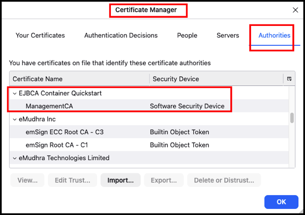
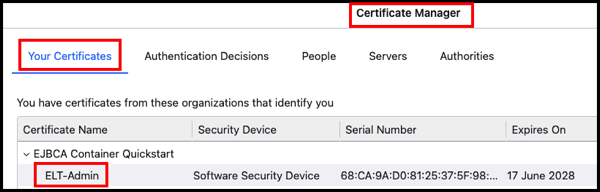
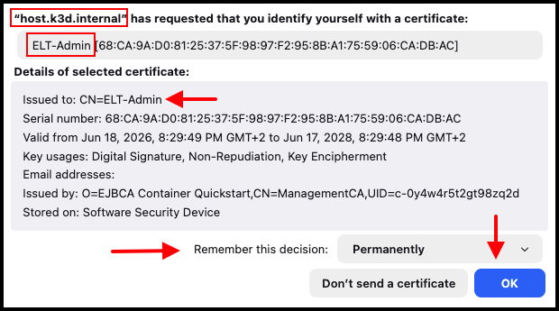
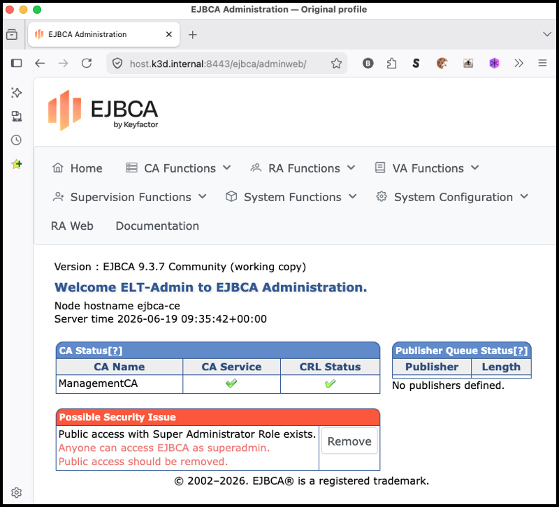
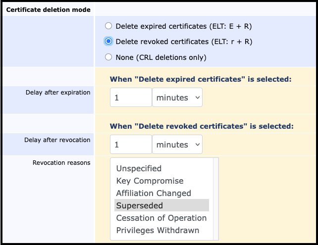

# EJBCA-CE Demo "manually"

*Manual steps of the "K8s cert-manager workflow demo",<br/>
 &nbsp; &nbsp; showing both the EJBCA-CE pull-requests results, and also<br/>
 &nbsp; &nbsp; stand-alone examples for K8s cert-manger work with CA & certificate transparency.*

**Author:** JohnB, with AI pair-programming support by Anthropic Claude<br/>
**Date:** 2026-06-21

**Audience:**<br/>
Keyfactor EJBCA-CE vendor reviewers, and EJBCA customers (aka operators)<br/>
&nbsp; &nbsp; who want to reproduce the Fix-26 / Fix-27 pull-requests from a fresh clone.

This walkthrough goes from `git clone` to both PR integration tests passing,<br/>
&nbsp; &nbsp; then finishes with the real-world scenario the PRs exist to solve.

*For the scripted fast path — the orchestrators that drive these same steps —<br/>
&nbsp; &nbsp; see [`DEMO-automated.md`](./DEMO-automated.md).*

## This workflow does two things at once:

- **Verify the fixes (for the Keyfactor reviewer):**<br/>
it reproduces, from a clean clone, the two EJBCA-CE pull requests<br/>
&nbsp; &nbsp; (Fix-26 and Fix-27) clearing the revoked-certificate accumulation that<br/>
&nbsp; &nbsp; cert-manager renewals produce. The visible before/after counts are the evidence.

- **Leave a working setup (for everyday users):**<br/>
as a by-product, the same steps leave a complete local setup the user can drive<br/>
&nbsp; &nbsp; from their own command line — create certs, inspect Kubernetes, run ELT,<br/>
&nbsp; &nbsp; run **cert-grep**. That working setup is a deliverable in its own right,<br/>
&nbsp; &nbsp; as useful to general users as the verification is to the vendor.

## Conventions in this doc:

- **`topDir`** is set once in `A02` and anchors every later block —<br/>
&nbsp; &nbsp; each command group re-`cd`s from it, so it works regardless of the current directory.

- **`certsDir`** (`/tmp/claude/demo/certs/`) is the single out-of-repo home for the<br/>
&nbsp; &nbsp; certs the tools use — set in `A01`, written by `214` (client cert + CA) and<br/>
&nbsp; &nbsp; `221` (server cert) during `B05`/`B06`, referenced thereafter. Nothing<br/>
&nbsp; &nbsp; credential-related is written inside the cloned repo.

- **`localDir`** (`/tmp/claude/demo/local/`) holds generated runtime config<br/>
&nbsp; &nbsp; (`ce-target.env`) — set in `A01`, written by `B06`, kept out of the repo.

- **`logDir`** (`/tmp/claude/demo/logs/`) holds the per-step run logs the `Log`<br/>
&nbsp; &nbsp; column names — set in `A01`; workflow scripts self-log here, manual steps<br/>
&nbsp; &nbsp; `tee` here. Out of the repo, like the others.

- **Step IDs are section-scoped** (`A01`, `A02`, …); adding a step renumbers only its section.
- **The `Log` column** names match the step IDs; a step that yields several logs<br/>
&nbsp; &nbsp; shares its ID prefix (e.g. `C05-dek-set` / `-show` / `-do`).

## Log files

Some scripted commands write their output to the indicated log files.

Bash commands and "tool scripts" are marked here with *Manual* which means<br/>
&nbsp; &nbsp; that you provide the logging yourself with a Bash construction like this:
```bash
$ docker compose -f stack/docker-compose.yml ps  2>&1 | tee $logDir/B02-show-clean-1.log
$ docker volume ls                               2>&1 | tee $logDir/B02-show-clean-2.log
```

Caution: Don't do this with Bash shells changing the log environment,<br/>
&nbsp; &nbsp; -- eg: `source`, `cd`, etc -- as the subshell will lose the changes.<br/>
These are marked "N/A" in the Log column.


## A. Set up the ecosystem and tools

| # | Step | Command | Log |
|---|---|---|---|
| A01 | Create a clean working<br/>&nbsp; directory and local dirs | `$ mkdir -p /tmp/claude/demo/`<br/>`$ cd /tmp/claude/demo/`<br/>`$ export certsDir="$(pwd)/certs/"`<br/>`$ export localDir="$(pwd)/local/"`<br/>`$ export logDir="$(pwd)/logs/"`<br/>`$ mkdir -p "$certsDir" "$localDir" "$logDir"` | N/A |
| A02 | Clone the bundle, set `topDir` | `$ git clone https://github.com/John-D-B/Claudes.git`<br/>`$ cd Claudes/2026-06-01.EJBCA-tools/`<br/>`$ topDir=$(pwd)` | *Manual*<br/>`A02-clone` |
| A03 | Set up Python deps and PATH | `$ python3 -m venv .venv`<br/>`$ source .venv/bin/activate`<br/>`$ pip install -r ./cg/requirements.txt`<br/>`$ pip install -r ./elt/requirements.txt`<br/>`$ export PATH="${topDir}/bin:$PATH"` | *Manual*<br/>`A03-deps` |
| A04 | Show tool location \& version | `$ which <tool>`<br/>`$ <tool> --version`<br/>deploy_ejbca_k8s.py, ejbca-lifecycle-tool.py, cert-grep.py,<br/>&nbsp; ssl-grep.py, docker, kubectl, k3d, helm, keytool, jq,<br/>&nbsp; openssl, python3, git | *Manual*<br/>`A04-tools` |

### Expanded: A01-A04

Steps `A01`–`A02` (working dir + clone) are unavoidable manual prep.

```bash
# - Prep:
$ mkdir -p /tmp/claude/demo/
$ cd /tmp/claude/demo/
$ git clone https://github.com/John-D-B/Claudes.git

# - Automation:
$ source ./Claudes/2026-06-01.EJBCA-tools/bin/setup.sh

# - Manual:
$ export certsDir="$(pwd)/certs"
$ export localDir="$(pwd)/local"
$ mkdir -p "$certsDir" "$localDir"
$ cd Claudes/2026-06-01.EJBCA-tools/
$ topDir=$(pwd)
#
$ python3 -m venv .venv
$ source .venv/bin/activate
$ pip install -r ./cg/requirements.txt
$ pip install -r ./elt/requirements.txt
$ export PATH="${topDir}/bin:$PATH"
$ which deploy_ejbca_k8s.py ejbca-lifecycle-tool.py cert-grep.py ssl-grep.py
$ which docker kubectl k3d helm keytool jq openssl python3 git
```

## B. Build the EJBCA-CE server (Docker)

The EJBCA-CE server is two Docker containers:
- `ejbca-ce` &nbsp; &nbsp; &nbsp; &nbsp; &nbsp; &nbsp; &nbsp; (the server)
- `ejbca-mariadb` &nbsp; &nbsp; (its database)<br/>
 
 These are defined in `stack/docker-compose.yml`.<br/>
Docker Desktop groups them under the compose project name `stack` (the directory name).<br/>
&nbsp; &nbsp; "From scratch" means wipe both, recreate them, and show the state after each step.

| # | Step | Command | Log |
|---|---|---|---|
| B00 | Prep | `$ cd ${topDir}/ejbca-ce/`<br/>`$ alias dek=deploy_ejbca_k8s.py`<br/>`$ alias elt=ejbca-lifecycle-tool.py`   | N/A |
| B01 | Wipe existing server \& database | `$ docker compose -f stack/docker-compose.yml down -v` | *Manual*<br/>`B01-wipe` |
| B02 | Show the clean slate:<br/>&nbsp; no containers,<br/>&nbsp; no database volume | `$ docker compose -f stack/docker-compose.yml ps`<br/>`$ docker volume ls` | *Manual*<br/>`B02-show-clean` |
| B03 | Create the two containers<br/>&nbsp; server + database | `$ docker compose -f stack/docker-compose.yml up -d` | *Manual*<br/>`B03-create` |
| B04 | Show them running | `$ docker compose -f stack/docker-compose.yml ps` | *Manual*<br/>`B04-show-running` |
| B05 | Bootstrap: writes the client<br/>&nbsp; creds into `$certsDir`<br/>&nbsp; (each `21N` script self-logs) | `$ for s in ./Bin/210.bootstrap/*.sh; do "$s" \|\| break; done` | `B05-verify-stack`<br/>`B05-superadmin`<br/>`B05-enable-rest`<br/>`B05-create-admin`<br/>`B05-truststore`<br/>`B05-verify-mtls`<br/>`B05-import-profiles`<br/>`B05-verify-profiles`<br/>`B05-reissue-cert` |
| B06 | Export the server cert into `$certsDir`,<br/>&nbsp; write `ce-target.env`, and source it<br/>&nbsp; (`214` already wrote the client cert + CA). | *(commands below)* | `B06-collect-certs` |
| B07 | Show the server configured<br/>&nbsp; (baseline certificate count) | `$ ejbca-lifecycle-tool.py count` | *Manual*<br/>`B07-show-configured` |
| B08 | Build the PR code (Fix-26 / Fix-27)<br/>&nbsp; into a new image:<br/>&nbsp; - `231` fetches upstream EJBCA<br/>&nbsp; - applies the bundled patches | `$ ./Bin/230.rebuild/231.build-local-image.sh` | `B08-build-image` |
| B09 | Swap the running container<br/>&nbsp; onto the new image | `$ ./Bin/230.rebuild/232.swap-stack-image.sh ejbca-ce:local-fixes` | `B09-swap` |
| B10 | Show the new image running | `$ docker compose -f stack/docker-compose.yml ps` | *Manual*<br/>`B10-show-image` |
| B11 | Confirm REST-API access with<br/>&nbsp; **Curl**, using the `ELT_*` vars. | `$ curl --cert "$ELT_CERT" --key "$ELT_KEY" \`<br/>&nbsp; &nbsp; `--cacert "$ELT_CA_CERT" \`<br/>&nbsp; &nbsp; `"https://$ELT_HOST:$ELT_PORT/ejbca/ejbca-rest-api/v1/ca"` | *Manual*<br/>`B11-curl` |
| B12 | Add the certs to Firefox<br/>&nbsp; (CA trust + client cert) — steps below. | *(manual — see below)* | N/A |
| B13 | Browse to the EJBCA-CE AdminWeb<br/>&nbsp; in Firefox — screenshot below. | *(open in browser)* | N/A |

### Expanded: B01-B06

The server build is one orchestrator — reset the image to the upstream base,<br/>
&nbsp; &nbsp; wipe, recreate, wait for the app, run the bootstrap, then collect the<br/>
&nbsp; &nbsp; certs. `B02`/`B04` are the "show" checkpoints; the bootstrap's first step<br/>
&nbsp; &nbsp; (`211.verify-stack`) waits for the app to deploy. A fresh bootstrap mints a<br/>
&nbsp; &nbsp; new ManagementCA, so `201` collects the certs in the same run — the only<br/>
&nbsp; &nbsp; thing left to do by hand is `source` the generated env.

```bash
$ cd ${topDir}/ejbca-ce/

# - Automation (B01-B06: reset+wipe, create, wait, bootstrap, collect certs):
$ ./Bin/200.build/201.build-server.sh
$ source ${localDir}/ce-target.env                            # B06: load the env 201 wrote

# - Manual:
$ docker compose -f stack/docker-compose.yml down -v          # B01 wipe
$ docker compose -f stack/docker-compose.yml ps               # B02 show clean
$ docker volume ls
$ docker compose -f stack/docker-compose.yml up -d            # B03 create
$ docker compose -f stack/docker-compose.yml ps               # B04 show running
$ for s in ./Bin/210.bootstrap/*.sh; do "$s" || break; done   # B05 bootstrap
```

### B06: Collect the certs and wire the shell

`201` already runs this as its final step; the block below is the by-hand<br/>
&nbsp; &nbsp; equivalent (and the `source` you run either way).<br/>
The ELT-Admin client cert and `ManagementCA` were written straight into<br/>
&nbsp; &nbsp; `${certsDir}` by `214` — no in-repo staging. The server cert lives only<br/>
&nbsp; &nbsp; inside the container keystore, so it is exported here with `keytool`; its<br/>
&nbsp; &nbsp; store password is generated per install and read from `server.storepasswd`.

```bash
# - Prep:
$ cd ${topDir}/ejbca-ce/    # - If not already here.

# - Automation:
$ ./Bin/220.certs/221.collect-certs.sh
$ source ${localDir}/ce-target.env

# - Manual: 214 already wrote ELT-Admin.{crt,key,p12,password} + ManagementCA.crt
#   straight into ${certsDir}; only the server cert + env file remain.

# - Server cert: export the leaf (alias host.k3d.internal) from the keystore.
$ docker compose -f stack/docker-compose.yml exec -T ejbca \
    sh -c 'keytool -exportcert -rfc -alias host.k3d.internal \
      -keystore /mnt/persistent/secrets/tls/ejbca-ce/server.jks \
      -storepass "$(cat /mnt/persistent/secrets/tls/ejbca-ce/server.storepasswd)"' \
    > ${certsDir}/host.k3d.internal.crt 2>/dev/null

# - Wire the shell so ELT / curl / cert-grep authenticate.
$ cat > ${localDir}/ce-target.env <<EOF
export ELT_HOST=host.k3d.internal
export ELT_PORT=8443
export ELT_CERT=${certsDir}/ELT-Admin.crt
export ELT_KEY=${certsDir}/ELT-Admin.key
export ELT_CA_CERT=${certsDir}/ManagementCA.crt
EOF

$ source ${localDir}/ce-target.env
```

### Expanded: B10

Confirm the swapped image is the one running (look for `ejbca-ce:local-fixes`):

```bash
$ docker compose -f stack/docker-compose.yml ps
```

### B11: Confirm REST-API access with Curl

```bash
$ hc='%{stderr}- http_code: %{http_code}\n'

$ curl -s -w "$hc" \
    --cert "$ELT_CERT" \
    --key "$ELT_KEY"   \
    --cacert "$ELT_CA_CERT" \
    "https://$ELT_HOST:$ELT_PORT/ejbca/ejbca-rest-api/v1/ca" \
    | jq

  - http_code: 200
    {
      "certificate_authorities": [
        {
          "id": -2123381211,
          "name": "ManagementCA",
          "subject_dn": "UID=c-0y4w4r5t2gt98zq2d,CN=ManagementCA,O=EJBCA Container Quickstart",
          "issuer_dn": "UID=c-0y4w4r5t2gt98zq2d,CN=ManagementCA,O=EJBCA Container Quickstart",
          "expiration_date": "2036-06-17T18:24:45Z",
          "external": false
        }
      ]
    }

# FYI: if 'jq' is not available, use this Python one-liner instead:
$ curl ... | python3 -m json.tool
```

### B12: Add the certs to the browser

*Examples shown here are with Firefox on MacOS.*

Both files are in `$certsDir` : `/tmp/claude/demo/certs/`

- **CA trust:**<br/>
Settings → Privacy & Security → Certificates → View Certificates →<br/>
&nbsp; &nbsp; **Authorities** → Import `ManagementCA.crt` → trust for identifying websites.



- **Client cert:**<br/>
same dialog → **Your Certificates** → Import `ELT-Admin.p12`<br/>
&nbsp; &nbsp; (password is in `ELT-Admin.password`).



**FYI: cert-grep**

```bash
$ cd ${certsDir}

# - Client certificate (for mTLS)
$ cert-grep.py  ELT-Admin.p12  PW=file:ELT-Admin.password  c0 summary_0

    0: Certificate:
      Issuer:          CN = ManagementCA
      Subject:         CN = ELT-Admin
      Serial Number:     68:ca:9a:d0:81:25:37:5f:98:97:f2:95:8b:a1:75:59:06:ca:db:ac
      Not Before:        Jun 18 18:29:49 2026 GMT
      Not After:         Jun 17 18:29:48 2028 GMT

# - Server certificate
$ cert-grep.py  host.k3d.internal.crt  c0 summary_0

    0: Certificate:
      Issuer:          CN = ManagementCA
      Subject:         CN = host.k3d.internal
      Serial Number:     54:17:07:f2:73:61:a7:5a:98:0f:aa:ca:5e:67:ce:87:77:ee:f1:4f
      Not Before:        Jun 18 18:36:12 2026 GMT
      Not After:         Jun 17 18:36:11 2028 GMT

# - CA certificate: the EJBCA paradigm
$ cert-grep.py  ManagementCA.crt  summary_0

    0: Certificate:
      Issuer:          CN = ManagementCA
      Subject:         CN = ManagementCA
      Serial Number:     77:c6:ae:2d:32:b6:80:b6:4c:a7:1a:dd:9a:59:4f:ac:a2:1c:c8:31
      Not Before:        Jun 18 18:24:46 2026 GMT
      Not After:         Jun 17 18:24:45 2036 GMT
```

**FYI: ssl-grep**

```bash
$ ssl-grep.py  "https://$ELT_HOST:$ELT_PORT"  summary_0

    0: Certificate:
      Issuer:          CN = ManagementCA
      Subject:         CN = host.k3d.internal
      Serial Number:     54:17:07:f2:73:61:a7:5a:98:0f:aa:ca:5e:67:ce:87:77:ee:f1:4f
      Not Before:        Jun 18 18:36:12 2026 GMT
      Not After:         Jun 17 18:36:11 2028 GMT

    1: Certificate:
      Issuer:          CN = ManagementCA
      Subject:         CN = ManagementCA
      Serial Number:     77:c6:ae:2d:32:b6:80:b6:4c:a7:1a:dd:9a:59:4f:ac:a2:1c:c8:31
      Not Before:        Jun 18 18:24:46 2026 GMT
      Not After:         Jun 17 18:24:45 2036 GMT
```


<br/>

### B13: Firefox browse to the AdminWeb

```bash
# FYI: This is localhost:
mac$ getent hosts host.k3d.internal
    host.k3d.internal 127.0.0.1

mac$ dscacheutil -q host -a name host.k3d.internal
    name: host.k3d.internal
    ip_address: 127.0.0.1
```

**Browse** to the new EJBCA-CE URL:<br/>
&nbsp; &nbsp; <https://host.k3d.internal:8443/ejbca/adminweb>

**Select** the ELT-Admin client cert when prompted:<br/>


**EJBCA-CE AdminWeb** start page:<br/>



## C. Build the k3d cluster for K8s cert-manager (Docker)

FYI: &nbsp; <https://k3d.io/><br/>
***k3d** is a lightweight wrapper to run **k3s** (Rancher Lab’s minimal **Kubernetes** distribution) in **Docker**.*

| # | Step | Command | Log |
|---|---|---|---|
| C00 | Prep | `$ cd ${topDir}/ejbca-ce/`<br/>`$ unset BD_SECRET_NAME  # dek prep` | N/A |
| C01 | Create the k3d cluster:<br/>&nbsp; **DEK** deploys into the current context. | `$ k3d cluster create ejbca-test` | *Manual*<br/>`C01-k3d-create` |
| C02 | Show the cluster running<br/>&nbsp; (nodes + system pods) | `$ kubectl get nodes`<br/>`$ kubectl get pods -A` | *Manual*<br/>`C02-show-cluster` |
| C03 | Map `host.k3d.internal` to the<br/>&nbsp; host gateway inside the cluster. | `$ kubectl apply -f ${topDir}/ejbca-ce/stack/coredns-custom.yaml`<br/>`$ kubectl -n kube-system rollout restart deployment/coredns` | *Manual*<br/>`C03-k3d-dns` |
| C04 | Show it resolves to the host gateway<br/>&nbsp; (in-cluster lookup) | `$ kubectl run dns-probe --rm --image busybox \`<br/>&nbsp; &nbsp; `--restart Never -- nslookup host.k3d.internal` | *Manual*<br/>`C04-show-dns` |
| C05 | Kubernetes cert-manager work:<br/>- Deploy cert-manager<br/>- Deploy EJBCA issuer<br/>- Issue a certificate. | `$ dek set --preset local-fixes`<br/>`$ dek show`<br/>`$ dek do` | *Manual*<br/>`C05-dek-set`<br/>`C05-dek-show`<br/>`C05-dek-do` |
| C06 | Show the issuer is Ready,<br/>&nbsp; and the certificate issued. | `$ kubectl get clusterissuer`<br/>`$ kubectl get certificate` | *Manual*<br/>`C06-show-cert` |

### Expanded: C01-C04

The cluster build is one orchestrator — create the k3d cluster, map<br/>
&nbsp; &nbsp; `host.k3d.internal` to the host gateway, roll coredns. `C02`/`C04` show.

```bash
$ cd ${topDir}/ejbca-ce/

# - Automation:
$ ./Bin/300.cluster/301.build-cluster.sh

# - Manual:
$ k3d cluster create ejbca-test                               # C01 create
$ kubectl get nodes                                           # C02 show cluster
$ kubectl get pods -A
$ kubectl apply -f stack/coredns-custom.yaml                  # C03 map DNS
$ kubectl -n kube-system rollout restart deployment/coredns
$ kubectl run dns-probe --rm --image busybox \                # C04 show resolves
    --restart Never -- nslookup host.k3d.internal
```

### C05: Kubernetes cert-manager work

Running the **DEK** script is a manual task for the end-user.

**DEK** is itself an automation (working prototype) of the "K8s real work" for issuing a certificate with cert-manager,<br/>
&nbsp; &nbsp; following Keyfactor's sample workflow here:

<https://docs.keyfactor.com/ejbca/9.3.2/tutorial-use-ejbca-with-cert-manager>

### Expanded: C06

Confirm the issuer is Ready and the first certificate issued:

```bash
$ kubectl get clusterissuer
$ kubectl get certificate
```

## D. Build up the revoked-certificate accumulation

*Each cert-manager renewal is a fresh enrollment on the same End Entity;<br/>
&nbsp; &nbsp; the Single Active Certificate Constraint auto-revokes the predecessor as<br/>
&nbsp; &nbsp; **SUPERSEDED** (confirmed live: reason code 4). That is the accumulation.*

| # | Step | Command | Log |
|---|---|---|---|
| D00 | Prep | `$ cd ${topDir}/ejbca-ce/`<br/>`$ export BD_SECRET_NAME=RANDOM  # dek prep` | N/A |
| D01 | Force repeated renewals<br/>(each renewal revokes its predecessor) | `$ dek do`<br/>(repeat N times) | *Manual*<br/>`D01-accumulate` |
| D02 | Count the accumulation | `$ elt count`<br/>`$ elt list4` | *Manual*<br/>`D02-elt-count`<br/>`D02-elt-list4` |
| D03 | Inspect one revoked certificate<br/>(note its reason: SUPERSEDED) | `$ elt list4 -cert-serial <serial> -c1` | *Manual*<br/>`D03-cert-detail` |

`D01` must leave at least two revoked certs, because section E divides them:
- `E01` (Fix-26) deletes one revoked certificate by explicit serial number.
- `E02` (Fix-27) deletes the remaining revoked certificates with the indicated constraints.
- N renewals leave N revoked certs; use N = 5 so the bulk delete removes several.

## E. Apply the two fixes (visible results, on the same `D01` accumulation)

| # | Step | Command | Log |
|---|---|---|---|
| E00 | Prep | `$ cd ${topDir}/ejbca-ce/stack/`| N/A |
| E01 | **Fix-26** — Targeted Delete<br/>Pick one revoked cert from the accumulation,<br/>&nbsp; &nbsp; delete it by serial via the REST endpoint.<br/>Count drops by exactly 1. | `$ qq="ejbca/ejbca-rest-api/v1/certificate/<issuer_dn>/<serial>"`<br/>`$ curl `<br/>&nbsp; &nbsp; `--cert "$ELT_CERT" \`<br/>&nbsp; &nbsp; `--key "$ELT_KEY" \`<br/>&nbsp; &nbsp; `--cacert "$ELT_CA_CERT" \`<br/>&nbsp; &nbsp; `-X DELETE \`<br/>&nbsp; &nbsp; `"https://$ELT_HOST:$ELT_PORT/${qq}"` | *Manual*<br/>`E01-fix-26` |
| E02 | **Fix-27** — DBMS bulk reaper<br/>Install the DatabaseMaintenanceWorker<br/>&nbsp; &nbsp; (reason filter SUPERSEDED, runs every minute).<br/>It deletes the remaining revoked certs.<br/>Count drops to the baseline. | **Scripted method:**<br/>`$ docker compose exec ejbca`<br/>&nbsp; &nbsp; `/opt/keyfactor/bin/ejbca.sh service create \`<br/>&nbsp; &nbsp; `--service Reaper \`<br/>&nbsp; &nbsp; `--properties "..."`<br/>*(The full command is below, with all properties)* | *Manual*<br/>`E02-fix-27` |

### E01: Targeted Delete (Fix-26)

The single `curl -X DELETE` above is the real method.

There is no "automation" wrapper script, because one manual REST Curl-call is all this demo needs.<br/>
&nbsp; &nbsp; `F01` then shows the count drop by exactly one.

End-users are free to use or adapt this Curl-call into whatever fits their situation, eg:<br/>
&nbsp; &nbsp; a cleanup job, an operator action, a scheduled task, etc.


### E02: DBMS Reaper: CLI setup (Fix-27)
Here is the full `E02` reaper install with all properties.<br/>
FYI: vendor script `ejbca.sh` splits `--properties` with single spaces,<br/>
  &nbsp; &nbsp; but here we do it one per line.

```bash
$ cd ${topDir}/ejbca-ce/stack/

$ props=(
    "workerClassPath=org.ejbca.core.model.services.workers.DatabaseMaintenanceWorker"
    "intervalClassPath=org.ejbca.core.model.services.intervals.PeriodicalInterval"
    "interval.periodical.unit=MINUTES"
    "interval.periodical.value=1"
    "actionClassPath=org.ejbca.core.model.services.actions.NoAction"
    "worker.certDeletionMode=REVOKED"
    "worker.deleteExpiredCrls=false"
    "worker.revocationReasons=SUPERSEDED"
    "worker.revokeDelayTimeUnit=SECONDS"
    "worker.revokeDelayTimeValue=0"
    "worker.batchSize=100"
    "active=true"
  )

$ docker compose exec ejbca \
    /opt/keyfactor/bin/ejbca.sh service create \
    --service Reaper \
    --properties "${props[*]}"
```

### E02: DBMS Reaper: GUI setup of an EJBCA service (Fix-27)

This is the preferred approach for end-user testing.<br/>
&nbsp; &nbsp; The Database Maintenance Worker only appears after the Fix-27 image is<br/>
&nbsp; &nbsp; running (steps `B08`–`B09`).

First create the service:
- **System Functions → Services → Add Service:** name it `Reaper`.
- **Edit `Reaper` → Select Worker:** **Database Maintenance Worker**.

Then set its Certificate deletion mode:
- **Certificate deletion mode:** select **Delete revoked certificates**.
- **Revocation reasons:** select **Superseded**.
- **Entries to delete per run:** 100.

Save, and let it run on its interval.

(Full GUI walkthrough: `Docs/ejbca-ce-task-3.5-fix-27-test-plan.md` §3.)

These map one-to-one onto the scripted `--properties` above:<br/>
- `certDeletionMode=REVOKED`
- `revocationReasons=SUPERSEDED`
- `batchSize=100`

<br/>




## F. Show the result

| # | Step | Command | Log |
|---|---|---|---|
| F00 | Prep | `$ cd ${topDir}/ejbca-ce/` | N/A |
| F01 | Count again:<br/>Accumulation cleared, active cert intact. | `$ elt count`<br/>`$ elt list4` | *Manual*<br/>`F01-elt-count`<br/>`F01-elt-list4` |

## What you can now do by hand

*The steps above leave your shell wired to a live setup.<br/>
&nbsp; &nbsp; From `${topDir}/ejbca-ce/`, the user can:*

- **Create or renew a certificate:**<br/>
`$ deploy_ejbca_k8s.py do`

- **Inspect the Kubernetes side:**<br/>
`$ kubectl get certificate`<br/>
`$ kubectl get clusterissuer`

- **Query the CA:**<br/>
`$ ejbca-lifecycle-tool.py count`<br/>
`$ ejbca-lifecycle-tool.py list4`

- **Examine a certificate:**<br/>
`$ cert-grep.py <cert.pem>`
